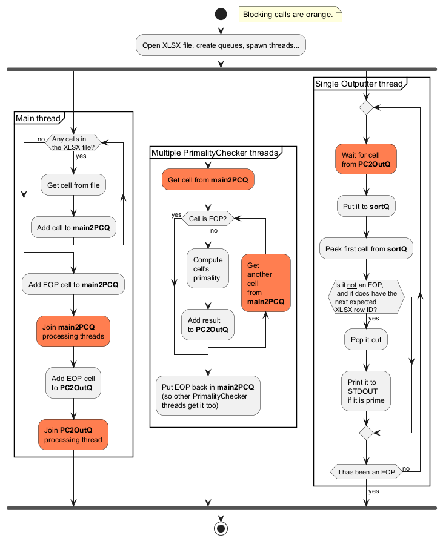

= Prime numbers checker

How to run this app:

[source,powershell]
----
mvn package
java -jar .\target\sdc-exercise-1.0-SNAPSHOT-jar-with-dependencies.jar -- '.\vzorek_dat - kopie.xlsx'
----

This app is built using https://jdk.java.net/25/[Java 25] and https://maven.apache.org/docs/3.9.11/release-notes.html[Maven 3.9.11].
VS Code has been used as a code editor, with the https://marketplace.visualstudio.com/items?itemName=vscjava.vscode-java-pack[Extension Pack for Java] extension.

== Multithreaded architecture

To speed up the processing, the app uses multiple threads communicating using queues.

=== Queues used

* `main2PCQ`: 
** `Main` thread adds cells read from the XLSX file to this queue
** `PrimalityChecker` threads read from this queue
* `PC2OutQ`:
** `PrimalityChecker` threads put cells with computed primality to this queue; these
    arrive in unspecified order
** `Outputter` thread reads cells from it
* `sortQ`
** `Outputter` thread uses it internally to sort incoming cells

=== Shutting down

The threads need to somehow know that there won't be any further cells coming in, and that they can end their existence (alternative would be to shut them down from the main thread).

This is done by adding an `EnhancedCell` (that's the class used to represent a cell) that is specifically marked as "End of Processing" (EOC). The shutdown sequence (and the whole processing) goes like this:

. Main thread puts all the cells from the XLSX file to the `main2PCQ` queue
. Then it puts in the EOC (so it is always the last cell added)
. When `PrimalityChecker` threads get this cell from the `main2PCQ`, they shut down (but they put it back first -- so all of them have the chance of seeing it)
. Main thread waits for all `PrimalityChecker` threads to join
** Now there is only the EOC left in `main2PCQ`
. Then it puts EOC to the `PC2OutQ`
. `Outputter` thread processes all the cells from `PC2OutQ` until it sees EOC, then it ends
. Main waits for the `Outputter` thread to join

The `Outputter` is checking that it has all the cells using their row ID. That means that if cells with row ID 1, 2, 5, 6, and 7 come in, it only processes cells 1 and 2, and then waits until cell with row ID 3 comes in.

=== Graphical representation

== Development-related questions & decisions

=== Which Excel library should I use?

This https://www.baeldung.com/java-microsoft-excel[Baeldung article] mentions three -- Apache POI, JExcel and Fastexcel.
Since I need to read `.xlsx` files, JExcel is out -- it only supports older `.xls` files.
Fastexcel is developed with emphasis on quick generation of files, but in general supports less `*.xlsx`-related features.

My bottleneck will most likely be the prime check, not the reading (that will happen only once) -- so I'll pick Apache POI, as it seems to be the most versatile tool -- in case I'd need to do anything else Excel-related in future, this seems to be pretty likely to support it.

=== How to approach logging?

The instructions say that I should use `Logger`.
I'll use Log4j, since:

* I'm used to work with it;
* Apache POI does already use it
* It does implement a [Logger]https://logging.apache.org/log4j/2.x/javadoc/log4j-api/org/apache/logging/log4j/Logger.html class as the instructions deem

I don't like the explicit `LogManager.getLogger()` stuff -- so this is the perfect time to also introduce https://projectlombok.org/features/log[Lombok].

=== Is the first row allways gonna contain 'Data' string?

It's not specified by the assignment.
So I'll treat it as ordinary data cell, that may contain valid data.

== Dev-related notes

=== Testing standard output

Finally, it works. It has been useful to create a https://github.com/RichardBenes/log4j2-tryout[separate project] just to figure it out.

The final solution is quite cumbersome, and it would be probably much better to use jUnit's https://docs.junit.org/current/user-guide/#running-tests-capturing-output[built-in] functionality... but that's yet another chapter.

So currently, I'm pretty much "just" adding another `Appender` to the Log4J2 config at runtime, which captures the log messages (only the `%m` part though) in memory, so I could check and assert that later.
There's quite a lot bolierplate code associated with that, and maybe it could be simplified by declaring the appender in the XML config.

What's nice -- this allows for testing the whole app, using only its `main()` entry point, and checking exactly what matters -- the data sent to the standard output. And all of that from within jUnit tests.

=== JShell

I tried using https://github.com/johnpoth/jshell-maven-plugin[`jshell-maven-plugin`]
so I could familiarize myself interactively with APIs I use.
It proved to be quite useful -- it prepares the JShell REPL with all the dependencies
from `pom.xml` loaded and ready to be imported.

The command to launch it is:

[source,powershell]
----
mvn jshell:run
----

=== Code coverage

Just run

[source, powershell]
----
mvn test
mvn jacoco:report
----

and then open the `/target/site/jacoco/index.html`.

To see coverage provided by a single test, run:

[source,powershell]
----
mvn clean test -Dtest=EnhancedCellTest
mvn jacoco:report
----

== PlantUML

To create the diagrams in this README, https://plantuml.com/starting[PlantUML] has been used.
The code is in the `*.puml` files, and they have been rendered manually. 
So yes, the resulting PNG files are included in the version control...

== Sources used

=== Primality cheking algorithm & its implementation

From Wikipedia, I found out that the https://en.wikipedia.org/wiki/AKS_primality_test[AKS] algorithm is currently pretty much the best option if deterministic results are required. From the assignment it seems to be the case, so I used that.

Implementation has been obtained from https://github.com/smanikar/primality-testing/blob/master/src/aks-final/AKS.java[smanikar/primality-testing].

I tried running the `AKSTest#testAKS` in parallel (https://docs.junit.org/current/user-guide/#writing-tests-parallel-execution[jUnit allows that]), but it didn't bring any signigicant time saving. 

=== Informational sources

Using AI has been denied. So I had to use "good ol' interned"...

* https://jdk.java.net/25/
* https://maven.apache.org/download.cgi
* https://github.com/junit-team/junit-examples/blob/r6.0.0/junit-jupiter-starter-maven/pom.xml
* https://central.sonatype.com
* https://www.baeldung.com/java-jar-executable-manifest-main-class#1-using-maven
* https://www.baeldung.com/java-microsoft-excel
* https://github.com/dhatim/fastexcel
* https://github.com/apache/poi
* https://poi.apache.org/
* https://poi.apache.org/apidocs/5.0/
* https://www.baeldung.com/java-try-with-
* https://www.baeldung.com/executable-jar-with-maven
* https://logging.apache.org/log4j/2.x/manual/installation.html
* https://projectlombok.org/setup/maven
* https://logging.apache.org/log4j/2.x/manual/getting-started.html
* https://stackoverflow.com/a/16699049/9556542
* https://commons.apache.org/proper/commons-lang/
* https://en.wikipedia.org/wiki/Primality_test
* https://en.wikipedia.org/wiki/AKS_primality_test
* https://stackoverflow.com/questions/4009198/java-get-greatest-common-divisor
* https://youtu.be/rQ7BzfRz7OY?si=0xRl9nzpCdA8v6xn
* https://support.microsoft.com/en-us/office/excel-specifications-and-limits-1672b34d-7043-467e-8e27-269d656771c3
* https://github.com/johnpoth/jshell-maven-plugin
* https://www.baeldung.com/junit-5-parallel-tests
* https://docs.junit.org/current/user-guide/#writing-tests-parallel-execution
* https://www.baeldung.com/jacoco
* https://javadoc.io/doc/org.mockito/mockito-core/latest/org.mockito/org/mockito/Mockito.html#0.3
* https://docs.oracle.com/en/java/javase/25/docs/api/java.base/java/lang/reflect/Field.html#get(java.lang.Object)
* https://www.baeldung.com/java-reflection-read-private-field-value
* https://docs.junit.org/current/user-guide/#writing-tests-test-execution-order-methods
* https://docs.oracle.com/javase/8/docs/api/java/io/ObjectOutputStream.html
* https://logging.apache.org/log4j/2.x/javadoc/log4j-core/org/apache/logging/log4j/core/appender/OutputStreamAppender.html
* https://logging.apache.org/log4j/2.x/manual/architecture.html